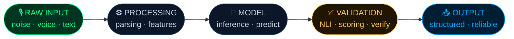
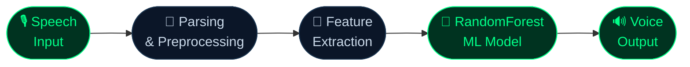
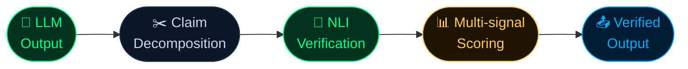

<!-- HEADER BANNER -->
<div align="center">


<!-- TYPING ANIMATION -->
[](https://git.io/typing-svg)

<br/>


&nbsp;

&nbsp;


<br/>

[](https://github.com/hrshjha)
&nbsp;
[](https://x.com/m_eharsh)

</div>

---

## `$ whoami`

```python
harsh_jha = {
    "role"        : "AI Systems Builder — Intern-level, Architecture-focused",
    "positioning" : "End-to-end AI pipelines · Validated outputs · Real-world constraints",
    "identity"    : "I transform unstructured input into decision-ready outputs.",

    "strict_rules": [
        "No demo-only systems",
        "No blind trust in model outputs",
        "No pipelines that break under noise",
        "Every system must handle imperfect input and uncertain outputs",
    ],

    "rule" : "If a system fails outside controlled conditions — it is incomplete."
}
```

---

## `$ cat core_thesis.md`

> Most projects stop at **"model works"**.
>
> I build systems that answer:
>
> — How does it handle **noisy input**?  
> — How is output **validated**, not assumed correct?  
> — What breaks under **latency or compute constraints**?  
> — Does it work **outside controlled environments**?

---

## `$ visualize pipeline`



| Stage | What I Actually Build |
|:---|:---|
| `RAW INPUT` | Voice audio, noisy text, unstructured real-world data |
| `PROCESSING` | Parsing, preprocessing, feature extraction layers |
| `MODEL` | ML inference, LLM generation, prediction pipelines |
| `VALIDATION` | NLI verification, scoring, claim-level checks — no blind trust |
| `OUTPUT` | Structured, decision-ready, verified results |

---

## `$ ls projects/`

<details>
<summary><b>📡 &nbsp;AgriMind — Voice-Based Crop Recommendation System</b></summary>
<br/>

**Problem**
> Crop advisory systems fail in real-world conditions — manual input, no accessibility, zero tolerance for noisy environments.

**System Architecture**



**Engineering Highlights**

```diff
+ Built speech-first pipeline — voice is the interface, not a fallback
+ Converts unstructured audio → structured feature vectors for ML
+ Handles noisy, imperfect voice input via custom preprocessing layers
+ Backend-controlled TTS → eliminates cross-browser inconsistency
+ Solved audio encoding + latency constraints under CPU limits
+ Works under real conditions — not just clean benchmark datasets
```

**Stack**


&nbsp;`RandomForest` &nbsp;`Whisper` &nbsp;`pyttsx3`

<br/>
</details>

---

<details>
<summary><b>🔍 &nbsp;Hallucination Hunter — Claim-Level LLM Verification System</b></summary>
<br/>

**Problem**
> LLMs generate fluent but partially wrong outputs. Most systems only catch total failure — not **partial hallucinations**.

**System Architecture**



**Engineering Highlights**

```diff
+ Atomic claim decomposition via linguistic parsing — not bulk response matching
+ NLI (entailment / contradiction) — not surface-level similarity checks
+ Multi-signal validation: semantic similarity + classification combined
+ Detects partial hallucinations — not just binary pass / fail
+ Modular pipeline — every stage independently replaceable
+ Interpretability layer: each claim mapped to supporting evidence
```

**Stack**


&nbsp;`DeBERTa-v3` &nbsp;`spaCy` &nbsp;`XGBoost`

<br/>
</details>

---

## `$ cat skills.sh`

<div align="center">

[](https://skillicons.dev)

</div>

<br/>

```bash
CORE        →  python  fastapi  machine-learning  nlp

AI SYSTEMS  →  llm-integration  prompt-engineering
               validation-pipelines  output-structuring

MODELS      →  scikit-learn  transformers  spacy  xgboost
               feature-engineering  inference-pipelines

FRONTEND    →  html  css  javascript

CURRENT     →  latency-optimization  llm-verification
               production-deployment  eval-benchmarking
```

---

## `$ cat approach.diff`

```diff
- scripts            +  SYSTEMS
- accuracy metrics   +  RELIABILITY  
- curated datasets   +  REAL-WORLD INPUT
- shortcuts          +  ARCHITECTURE
```

---

## `$ github --stats`

<p align="center">

  
  
  

</p>

<p align="center">

  

</p>

<p align="center">

  

</p>

---

## `$ cat looking_for.txt`

```
TARGET  →  AI / Backend / Product Engineering Internship

BRINGS  →  System-level thinking
        →  Pipeline design — not just models
        →  Ships working, integrated, production-ready systems

LINKS   →  github.com/hrshjha
        →  x.com/m_eharsh
```

---

<!-- FOOTER -->
<div align="center">

<br/>

*This is not a collection of projects.*<br/>
*It is a direction —*<br/>
**Building AI systems that work under real conditions, not ideal ones.**

<br/>


</div>
