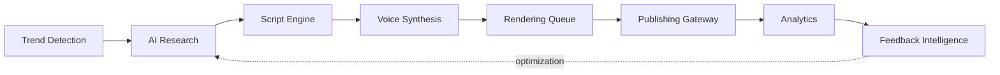
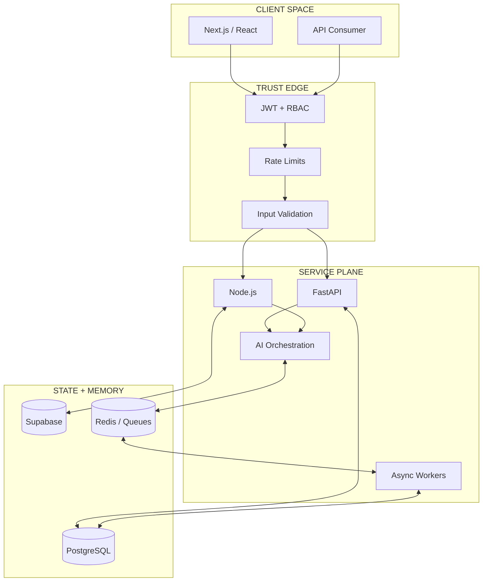

<div align="center">


<a href="https://github.com/HrshJha"></a>

<br />

<a href="https://github.com/HrshJha?tab=followers"></a>

<a href="https://contactharsh.in"></a>

</div>

<br />

```text
┌──────────────────────────────────────────────────────────────────────────────────────┐
│  HARSH.OS / PROFILE INTERFACE                                             BUILD 01.00 │
├──────────────────────────────────────────────────────────────────────────────────────┤
│  identity      Harsh Jha                                                               │
│  role          AI Systems Engineer                                                     │
│  directive     Make intelligent systems dependable outside the demo.                   │
│  location      India / operating globally                                               │
│  signal        Production AI · Backend Systems · ML Infrastructure                     │
└──────────────────────────────────────────────────────────────────────────────────────┘
```

<div align="center">


</div>

---

<details open>
<summary><code>01 / BOOT_SEQUENCE</code></summary>

<br />

```console
$ ./initialize --profile harsh-jha --mode production

[00:00:00.001]  loading identity module ...................................... OK
[00:00:00.041]  mounting engineering principles .............................. OK
[00:00:00.078]  connecting distributed-systems context ...................... OK
[00:00:00.113]  warming model-evaluation layer ............................... OK
[00:00:00.159]  enabling observability ....................................... OK
[00:00:00.201]  syncing current mission ...................................... OK

  HARSH.OS is online.
  Build systems that deserve production.
```

</details>

---

<table>
<tr>
<td width="50%" valign="top">

```yaml
system_profile:
  core:
    - production AI
    - backend engineering
    - machine learning
    - LLM evaluation
  operating_principles:
    verification: "> confidence"
    evidence: "> assumptions"
    systems: "> demos"
  current_vector:
    - distributed systems
    - MLOps
    - Kubernetes
    - advanced LLM systems
```

</td>
<td width="50%" valign="top">

```text
┌── CURRENT_FOCUS ────────────────────┐
│                                     │
│  [01] FrameOS                       │
│  [02] Production AI APIs            │
│  [03] Reliable evaluation pipelines │
│  [04] Systems design                │
│                                     │
│  state: BUILDING                    │
│  clock: continuous                  │
└─────────────────────────────────────┘
```

</td>
</tr>
</table>

---

<details open>
<summary><code>02 / COMMAND_PALETTE</code></summary>

<br />

```bash
harsh@github:~$ help

  whoami              inspect the operator
  status              inspect live priorities
  stack --graph       map the technical ecosystem
  projects --active   open deployed workspaces
  philosophy          print engineering constraints
  contact             open mission-control uplink

harsh@github:~$ whoami
AI Systems Engineer focused on the hard parts around AI:
validation, orchestration, retrieval, observability, APIs, and scalable inference.
```

</details>

---

## ◈ SIGNAL ARCHITECTURE

<div align="center">


</div>

<br />


```mermaid
flowchart LR
  U["Signal / User Intent"] --> A["Interface Layer\nNext.js · React"]
  A --> B["Service Layer\nFastAPI · REST · Node.js"]
  B --> C["Intelligence Layer\nLLMs · Transformers · Evaluation"]
  C --> D["Trust Layer\nValidation · Evidence · Guardrails"]
  D --> E["State Layer\nPostgreSQL · Supabase · Redis"]
  E --> F["Operations Layer\nDocker · Linux · CI/CD"]

  classDef green fill:#00F5A0,stroke:#050816,color:#050816;
  classDef cyan fill:#00D9FF,stroke:#050816,color:#050816;
  classDef violet fill:#7C3AED,stroke:#050816,color:#FFFFFF;
  class U,A green;
  class B,C cyan;
  class D,E,F violet;
```

<table>
<tr><th align="left">CLUSTER</th><th align="left">TOOLS IN ORBIT</th><th align="left">INTENT</th></tr>
<tr><td><code>LANGUAGE_CORE</code></td><td>Python · Java · C++ · TypeScript</td><td>Build durable, understandable systems.</td></tr>
<tr><td><code>API_SURFACE</code></td><td>FastAPI · REST APIs · Node.js</td><td>Expose intelligence through dependable interfaces.</td></tr>
<tr><td><code>MODEL_LAB</code></td><td>Transformers · Sentence Transformers · scikit-learn · spaCy · XGBoost · Whisper</td><td>Evaluate models against real operational requirements.</td></tr>
<tr><td><code>STATE_ENGINE</code></td><td>PostgreSQL · Supabase · Redis · MongoDB</td><td>Keep workflows observable, recoverable, and fast.</td></tr>
<tr><td><code>SHIP_LAYER</code></td><td>Docker · GitHub Actions · Linux · Vercel</td><td>Move from experiment to reliable operation.</td></tr>
</table>

---

## ◈ NEURAL ACTIVITY

```text
                              ┌─────────── RESEARCH ───────────┐
                              │  papers · systems · tradeoffs   │
                              └──────────────┬──────────────────┘
                                             │
     ┌─────────── BUILD ───────────┐         ▼         ┌────────── OBSERVE ──────────┐
     │ APIs · queues · interfaces  │ ──► [ VERIFY ] ◄── │ metrics · logs · feedback  │
     └────────────┬────────────────┘         │         └─────────────┬────────────────┘
                  │                          ▼                       │
                  └──────────────────► [ SHIP ] ◄────────────────────┘
                                      production
```

<table>
<tr>
<td width="33%" valign="top">

<b>01 — MODEL REALITY</b><br />
Model output is a proposal, not a fact. Extract claims, retrieve evidence, calibrate confidence, and make uncertainty visible.

</td>
<td width="33%" valign="top">

<b>02 — SYSTEM REALITY</b><br />
The model is one component. Queues, timeouts, validation, storage, and failure paths determine whether the product actually works.

</td>
<td width="33%" valign="top">

<b>03 — USER REALITY</b><br />
Reliable systems lower cognitive load. The interface should make complex workflows feel legible and controlled.

</td>
</tr>
</table>

---

## ◈ MISSION WORKSPACES

<details open>
<summary><code>PROJECT_01 / FRAMEOS</code> — AI-native media infrastructure</summary>

<br />

<table>
<tr><td width="68%" valign="top">

**FrameOS** turns fragmented content work into an event-driven operating pipeline: research, planning, script generation, voice, rendering, publishing, analytics, and feedback. It is designed for content teams that need repeatable output without endless context switching.


```mermaid
flowchart LR
  T["Trend Detection"] --> R["AI Research"]
  R --> S["Script Engine"]
  S --> V["Voice Synthesis"]
  V --> X["Rendering Queue"]
  X --> P["Publishing Gateway"]
  P --> A["Analytics"]
  A --> F["Feedback Intelligence"]
  F -. optimization .-> R
```

</td><td width="32%" valign="top">

```text
STATUS       ACTIVE
MODE         EVENT-DRIVEN
INTERFACE    NEXT.JS
STATE        POSTGRESQL
QUEUE        REDIS
SECURITY     JWT + RBAC
```

</td></tr>
</table>

| System concern | Implementation vector |
| --- | --- |
| Orchestration | Multi-stage AI workflow pipeline with queue isolation. |
| Brand consistency | Persistent brand-voice locking throughout content assembly. |
| Intelligence | Trend detection, research synthesis, retention-aware scripting, predictive scoring. |
| Trust boundary | JWT authentication, RBAC, validation, rate limiting, sanitization, database policy enforcement. |
| Operations | Docker, Cloudflare, Nginx, GitHub Actions, Supabase, Upstash Redis. |

`Next.js` `React` `TypeScript` `Prisma` `PostgreSQL` `Supabase` `Redis` `OpenAI` `Google AI` `ElevenLabs` `Docker`

→ [Open repository](https://github.com/HrshJha/FrameOS) · [Project signal](https://github.com/HrshJha/FrameOS)

</details>

<details>
<summary><code>PROJECT_02 / HALLUCINATION_HUNTER</code> — claim-level verification</summary>

<br />

```text
LLM OUTPUT → CLAIM EXTRACTION → EVIDENCE RETRIEVAL → NLI VERIFICATION
           → CONFIDENCE CALIBRATION → EXPLAINABLE VERIFIED REPORT
```

An evaluation-first system for treating generated claims as testable units. It combines evidence retrieval, DeBERTa-based NLI, XGBoost scoring, FastAPI delivery, and explanations that reveal why confidence changed.

`DeBERTa` `NLI` `XGBoost` `FastAPI` `Evidence retrieval` `Explainability`

</details>

<details>
<summary><code>PROJECT_03 / RESUME_INTELLIGENCE</code> — recruiter-aware resume analysis</summary>

<br />

```text
RESUME → STRUCTURED PARSE → SKILL EXTRACTION → SEMANTIC MATCHING
       → ATS SIGNALS → RANKING → RECRUITER-READY INSIGHTS
```

An AI-powered resume intelligence workflow focused on useful candidate signals: parsing, ATS scoring, skill extraction, semantic matching, and ranking.

`LLM reasoning` `Semantic matching` `ATS scoring` `Candidate ranking`

</details>

<details>
<summary><code>PROJECT_04 / AGRIMIND</code> — voice-first agricultural assistance</summary>

<br />

```text
VOICE INPUT → WHISPER → FEATURE PIPELINE → RANDOM FOREST
            → CROP RECOMMENDATION → LOCALIZED RESPONSE
```

Designed to keep the inference path useful on CPU hardware, combining speech input, crop recommendations, and localized responses.

`Whisper` `Random Forest` `FastAPI` `CPU-optimized inference`

</details>

<details>
<summary><code>PROJECT_05 / PROMPT_POLICE</code> — prompt firewall and security analysis</summary>

<br />

```text
UNTRUSTED PROMPT → PATTERN ANALYSIS → INJECTION SIGNALS → RISK DECISION
                 → POLICY RESPONSE → AUDITABLE OUTCOME
```

A security-oriented layer for identifying prompt injection and unsafe prompt behavior before it becomes an application-level failure.

`Prompt security` `Policy analysis` `Guardrails` `Risk detection`

</details>

---

## ◈ RELIABILITY MANIFEST

```cpp
namespace production {

  constexpr auto principle_01 = "Verification over confidence";
  constexpr auto principle_02 = "Evidence over assumptions";
  constexpr auto principle_03 = "Systems over demos";

  while (there_is_more_to_learn) {
    research();
    build();
    measure();
    break_things_safely();
    fix_root_causes();
    ship();
  }
}
```

<table>
<tr><th align="left">CONSTRAINT</th><th align="left">WHAT IT MEANS IN PRACTICE</th></tr>
<tr><td><code>OBSERVABILITY</code></td><td>If a system cannot explain its state, it cannot be trusted at scale.</td></tr>
<tr><td><code>VALIDATION</code></td><td>Confidence scores do not replace evidence, policy, or clear failure handling.</td></tr>
<tr><td><code>SIMPLE_INTERFACES</code></td><td>Complexity compounds. Keep the surface area legible and the contracts explicit.</td></tr>
<tr><td><code>ASYNC_BY_DEFAULT</code></td><td>Long-running intelligence belongs behind durable queues, not fragile request lifecycles.</td></tr>
<tr><td><code>SECURE_BOUNDARIES</code></td><td>Authentication, authorization, rate limits, and input controls are product features.</td></tr>
</table>

---

## ◈ SYSTEM TOPOLOGY


```mermaid
flowchart TB
  subgraph CLIENT["CLIENT SPACE"]
    WEB["Next.js / React"]
    APIUSER["API Consumer"]
  end

  subgraph EDGE["TRUST EDGE"]
    AUTH["JWT + RBAC"]
    RATE["Rate Limits"]
    VALIDATE["Input Validation"]
  end

  subgraph SERVICES["SERVICE PLANE"]
    FAST["FastAPI"]
    NODE["Node.js"]
    AGENT["AI Orchestration"]
    WORKER["Async Workers"]
  end

  subgraph DATA["STATE + MEMORY"]
    PG[("PostgreSQL")]
    SUP[("Supabase")]
    REDIS[("Redis / Queues")]
  end

  WEB --> AUTH
  APIUSER --> AUTH
  AUTH --> RATE --> VALIDATE
  VALIDATE --> FAST
  VALIDATE --> NODE
  FAST --> AGENT
  NODE --> AGENT
  AGENT <--> REDIS
  REDIS <--> WORKER
  FAST <--> PG
  NODE <--> SUP
  WORKER <--> PG
```

---

## ◈ LEARNING VECTOR

```text
NOW
 ├── System Design              ── designing for failure, latency, and growth
 ├── Distributed Systems        ── consistency, queues, partitions, coordination
 ├── MLOps                      ── reproducibility, monitoring, deployment paths
 ├── Kubernetes                 ── workload orchestration and platform thinking
 └── Advanced LLM Systems       ── evaluation, retrieval, agents, guardrails

NEXT
 └── More systems that make model behavior measurable, controllable, and useful.
```

---

<div align="center">


<br />


</div>

---

## ◈ MISSION CONTROL

```text
┌─────────────────────────────────────────────────────────────────────┐
│  EXTERNAL UPLINKS                                                    │
├─────────────────────────────────────────────────────────────────────┤
│  GITHUB       github.com/HrshJha                                    │
│  PORTFOLIO    contactharsh.in                                       │
│  X            x.com/m_eharsh                                       │
│                                                                     │
│  Available for conversations about AI systems, backend reliability, │
│  evaluation, infrastructure, and difficult engineering problems.    │
└─────────────────────────────────────────────────────────────────────┘
```

<div align="center">

<a href="https://github.com/HrshJha"></a>
<a href="https://contactharsh.in"></a>
<a href="https://x.com/m_eharsh"></a>

</div>

<br />

<div align="center">


<br />

<code>STATUS: BUILDING · TESTING · LEARNING · SHIPPING</code>

</div>


