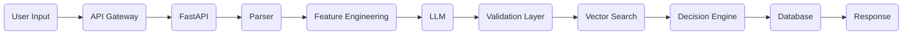

<div align="center">


<br>


</div>

---

# $ whoami

```bash
harsh@github:~$ whoami

Name      : Harsh Jha

Role      : AI Systems Engineer

Focus     : Production AI
             Backend Engineering
             LLM Evaluation
             ML Infrastructure

Philosophy:
Verification > Confidence
Evidence > Assumptions
Systems > Demos
```

---

# About

I enjoy building AI systems that continue working after the demo ends.

Most AI projects stop at generating text. I build the layers around the model—

- validation
- orchestration
- retrieval
- monitoring
- production APIs
- scalable inference

Current interests include:

- Production Machine Learning
- Retrieval-Augmented Generation
- LLM Evaluation
- Distributed Backend Systems
- AI Infrastructure
- FastAPI Services

---

# Tech Stack

<div align="center">


</div>

---

# AI Architecture


```mermaid
flowchart LR

A(User Input)
-->B(API Gateway)

B
-->C(FastAPI)

C
-->D(Parser)

D
-->E(Feature Engineering)

E
-->F(LLM)

F
-->G(Validation Layer)

G
-->H(Vector Search)

H
-->I(Decision Engine)

I
-->J(Database)

J
-->K(Response)
```

---

# Current Projects

## FrameOS

```
AI Native Content Operating System

Research
↓

Planning

↓

Script Generation

↓

Rendering

↓

Publishing

↓

Analytics
```

**Tech**

- Next.js
- FastAPI
- PostgreSQL
- Redis
- Docker
- AI Agents

---

## Hallucination Hunter

```
LLM Output

↓

Claim Extraction

↓

Evidence Retrieval

↓

NLI Verification

↓

Confidence Calibration

↓

Verified Report
```

**Highlights**

- Claim-level verification
- DeBERTa
- XGBoost
- FastAPI
- Explainable scoring

---

## Resume Intelligence

Production resume parser powered by AI.

Features

- ATS scoring
- Resume parsing
- Skill extraction
- Candidate ranking
- LLM reasoning

---

## AgriMind

Voice-first agriculture assistant.

Pipeline

```
Voice

↓

Whisper

↓

Random Forest

↓

Crop Recommendation

↓

Localized Response
```

Runs efficiently on CPU hardware.

---

# GitHub Analytics

<div align="center">


</div>

---

<div align="center">


</div>

---

# Contribution Graph

<div align="center">


</div>

---

# GitHub Trophies

<div align="center">


</div>

---

# Current Focus

```yaml
Building:
  - FrameOS
  - Resume Intelligence
  - Production AI APIs

Learning:
  - Distributed Systems
  - System Design
  - MLOps
  - Kubernetes

Research:
  - Retrieval Systems
  - LLM Evaluation
  - AI Agents
```

---

# Tech Philosophy

```cpp
while(true){

    Learn();

    Build();

    Break();

    Fix();

    Ship();

    Repeat();

}
```

---

# Development Workflow

```text
Idea
 │
 ▼
Research
 │
 ▼
Prototype
 │
 ▼
Benchmark
 │
 ▼
Optimize
 │
 ▼
Deploy
 │
 ▼
Monitor
 │
 ▼
Improve
```

---

# Engineering Principles

| Principle | Description |
|-----------|-------------|
| Reliability | Systems should survive real users |
| Observability | Measure everything |
| Simplicity | Complexity compounds |
| Validation | Never trust model confidence blindly |
| Automation | Remove repetitive work |

---

# Connect

<div align="center">

<a href="https://github.com/HrshJha">

</a>

<a href="https://x.com/m_eharsh">

</a>

<a href="mailto:YOUR_EMAIL">

</a>

<a href="https://www.linkedin.com/in/YOUR_LINKEDIN">

</a>

</div>

---

<div align="center">

## "Build systems that deserve production."


</div>


