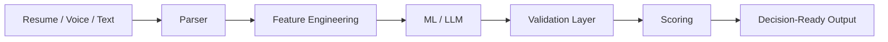

<div align="center">


<br/>


<br/>

`AI SYSTEMS` · `BACKEND` · `LLM EVALUATION`

</div>

<br/>

```
$ whoami
```

I build AI systems that survive the parts a demo never shows you — noisy
input, uncertain model output, latency budgets, and the long tail of
production traffic. Verification over vibes. Evidence over confidence
scores.

<br/>

### `stack --by-role`

<table>
<tr>
<td width="140"><code>languages</code></td>
<td>


</td>
</tr>
<tr>
<td><code>backend</code></td>
<td>


</td>
</tr>
<tr>
<td><code>ai / ml</code></td>
<td>


</td>
</tr>
<tr>
<td><code>tools</code></td>
<td>


</td>
</tr>
</table>

<br/>

### `projects --featured`

<table>
<tr>
<td width="50%" valign="top">

**🔍 Hallucination Hunter**

Claim-level verification for LLM output. Splits a response into
individual claims, checks each one against retrieved evidence with an
NLI model, and scores the result — instead of trusting the model's own
confidence.

`DeBERTa` `XGBoost` `FastAPI` `NLI validation`

</td>
<td width="50%" valign="top">

**🌾 AgriMind**

Voice-first crop recommendation for growers who'd rather talk than
type. Whisper transcribes, a RandomForest model scores the field
conditions, and the whole pipeline runs on CPU — no GPU required in
the field.

`Whisper` `RandomForest` `CPU inference`

</td>
</tr>
</table>

<br/>

### `pipeline.yml`


```mermaid
flowchart LR
    A[Resume / Voice / Text] --> B[Parser]
    B --> C[Feature Engineering]
    C --> D[ML / LLM]
    D --> E[Validation Layer]
    E --> F[Scoring]
    F --> G[Decision-Ready Output]
```

<br/>

### `focus --current`

```
> AI infrastructure
> resume intelligence
> LLM evaluation
> production ML
```

<br/>

<div align="center">


<br/><br/>


</div>

<br/>

### `contact`

<div align="center">

<a href="https://github.com/HrshJha"></a>
<a href="https://x.com/m_eharsh"></a>

</div>

<br/>

<div align="center">

```
build systems that work outside controlled environments.
```


</div>
