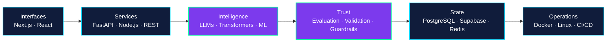
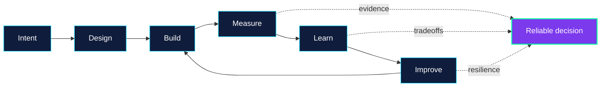

<div align="center">


<a href="https://github.com/HrshJha"></a>

<br />

<a href="https://github.com/HrshJha"></a>
<a href="https://contactharsh.in"></a>
<a href="https://x.com/m_eharsh"></a>

</div>

<br />

```text
┌─────────────────────────────────────────────────────────────────────────────┐
│ HARSH.OS                                                    STATUS: ONLINE   │
├─────────────────────────────────────────────────────────────────────────────┤
│ Focus     Production AI · Distributed Backends · LLM Evaluation              │
│ Building  Systems that are observable, secure, and useful at scale           │
│ Belief    A model response is a proposal — verification makes it reliable    │
└─────────────────────────────────────────────────────────────────────────────┘
```

## `> whoami`

I’m Harsh, an AI Systems Engineer focused on the engineering around intelligent products: dependable APIs, asynchronous workflows, model evaluation, retrieval, security boundaries, and infrastructure that survives real usage.

My work sits at the point where backend systems and machine learning meet. I care about failure modes, latency, evidence, clean interfaces, and the operational details that turn a convincing prototype into a credible product.

<table>
<tr>
<td width="50%" valign="top">

```yaml
currently_exploring:
  - System Design
  - Distributed Systems
  - MLOps
  - Kubernetes
  - Advanced LLM Systems
```

</td>
<td width="50%" valign="top">

```yaml
operating_rules:
  - Verify before trusting
  - Measure before optimizing
  - Automate repeated work
  - Keep failure paths explicit
```

</td>
</tr>
</table>

---

## `> stack --visualize`


```mermaid
flowchart LR
  UI["Interfaces\nNext.js · React"] --> API["Services\nFastAPI · Node.js · REST"]
  API --> AI["Intelligence\nLLMs · Transformers · ML"]
  AI --> TRUST["Trust\nEvaluation · Validation · Guardrails"]
  TRUST --> DATA["State\nPostgreSQL · Supabase · Redis"]
  DATA --> OPS["Operations\nDocker · Linux · CI/CD"]

  classDef node fill:#101C3B,stroke:#00D9FF,color:#FFFFFF,stroke-width:1.5px;
  classDef highlight fill:#7C3AED,stroke:#00F5A0,color:#FFFFFF,stroke-width:2px;
  class UI,API,DATA,OPS node;
  class AI,TRUST highlight;
```

<div align="center">


</div>

| Layer | Working with |
| --- | --- |
| **Languages** | Python, Java, C++, TypeScript |
| **Backend** | FastAPI, REST APIs, Node.js |
| **AI / ML** | Transformers, Sentence Transformers, scikit-learn, spaCy, XGBoost, Whisper, OpenAI APIs |
| **Data** | PostgreSQL, Supabase, Redis, MongoDB |
| **Frontend** | Next.js, React |
| **Delivery** | Docker, GitHub Actions, Linux, Vercel |

---

## `> projects --all`

<table>
<tr>
<td width="50%" valign="top">

### 01 — FrameOS

**AI-native media orchestration.**

An event-driven platform that connects research, scripting, voice, rendering, publishing, analytics, and feedback into one content operation.

`Next.js` `PostgreSQL` `Redis` `AI agents` `Docker`

[View source →](https://github.com/HrshJha/FrameOS)

</td>
<td width="50%" valign="top">

### 02 — Hallucination Hunter

**Claim-level LLM verification.**

Extracts claims, retrieves evidence, applies NLI verification, and produces calibrated, explainable confidence signals.

`DeBERTa` `NLI` `XGBoost` `FastAPI` `Retrieval`

`OUTPUT: verified report`

</td>
</tr>
<tr>
<td width="50%" valign="top">

### 03 — Resume Intelligence

**Resume analysis for clearer hiring signals.**

AI-assisted parsing, ATS scoring, skill extraction, semantic matching, and candidate ranking built around recruiter workflows.

`LLM reasoning` `Semantic search` `ATS` `Ranking`

`OUTPUT: candidate insight`

</td>
<td width="50%" valign="top">

### 04 — AgriMind

**Voice-first crop recommendation.**

A practical, localized assistant that moves from spoken input to CPU-efficient crop guidance.

`Whisper` `Random Forest` `FastAPI` `CPU inference`

`OUTPUT: localized recommendation`

</td>
</tr>
<tr>
<td width="50%" valign="top">

### 05 — Prompt Police

**Prompt security analysis.**

A protective layer for detecting prompt injection and unsafe inputs before they become downstream application failures.

`Prompt firewall` `Risk analysis` `Guardrails`

`OUTPUT: actionable security signal`

</td>
<td width="50%" valign="top">

### ∞ — In the lab

**Systems with better failure behavior.**

Exploring evaluation architectures, reliable agent workflows, observability, distributed execution, and practical MLOps.

`Research` `Prototypes` `Benchmarks` `Feedback loops`

`STATUS: continuous`

</td>
</tr>
</table>

---

## `> cat philosophy.txt`

```text
The model is not the system.

The system includes its inputs, validation, data, queues, retries, timeouts,
monitoring, security boundaries, and the clarity of its interface.

Good AI engineering makes all of that visible — and makes the failure modes
graceful when the world stops behaving like the demo.
```


```mermaid
flowchart LR
  A["Intent"] --> B["Design"] --> C["Build"] --> D["Measure"]
  D --> E["Learn"] --> F["Improve"] --> C
  D -. evidence .-> G["Reliable decision"]
  E -. tradeoffs .-> G
  F -. resilience .-> G

  classDef phase fill:#101C3B,stroke:#00D9FF,color:#FFFFFF;
  classDef result fill:#7C3AED,stroke:#00F5A0,color:#FFFFFF,stroke-width:2px;
  class A,B,C,D,E,F phase;
  class G result;
```

| Principle | Engineering consequence |
| --- | --- |
| **Verification > confidence** | Treat generated output as a hypothesis to test. |
| **Evidence > assumptions** | Retrieve, measure, and log the signals that matter. |
| **Systems > demos** | Design for retries, queues, failure recovery, and maintainability. |
| **Observability is product work** | Make state and behavior understandable in production. |

---

## `> git activity`

<div align="center">


<br />


</div>

---

## `> contact --open`

<div align="center">

<a href="https://github.com/HrshJha"></a>
<a href="https://contactharsh.in"></a>
<a href="https://x.com/m_eharsh"></a>

<br /><br />

<code>BUILDING INTELLIGENCE THAT EARNS TRUST.</code>

<br /><br />


</div>


